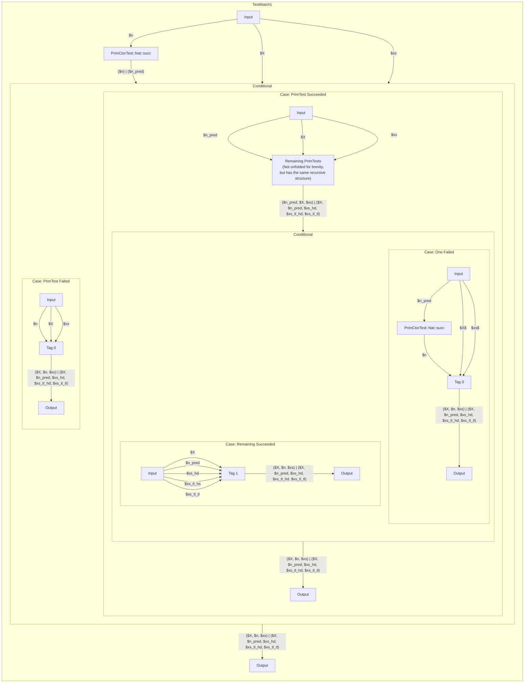

# Pattern Matching

This document describes the current pattern matching implementation in Brat.

As a running example, we will use the following pattern matching program:

```
deal(X :: *, n :: #, xs :: Vec(X, doub(n))) -> Vec(X, n), Vec(X, n)
deal(Y, succ(m), cons(x, cons(y, zs))) =
  let as, bs = deal(X, m, zs) in cons(x, as), cons(y, bs)
deal(Y, 0, []) = [], []
```

## Checking

During type-checking, we have to ensure that the patterns in each clause are actually valid for the function signature.
For example, the following clause should be rejected by the compiler:

```
deal(X, 0, cons(x, xs)) = ...   -- Cons pattern is not valid for n = 0
```

At the moment, we check clauses independently of each other.
This means we don't consider information gained from the knowledge that previous clauses have failed.
For example, the following program is rejected:

```
foo(n :: #, Vec(Int, n)) -> Int
foo(0, _) = -1
foo(n, cons(x, _)) = x  -- Not smart enough to figure out that n > 0
```

Furthermore, we're not doing any exhaustiveness and reachability checking for now.


### Clause Problem

We check clause patterns by solving a system of equations between named sources (standing for the arguments) and patterns. In the Brat compiler, we call this a *problem*: `type Problem = [(Src, Pattern)]`.

For each clause, we construct a problem by creating sources for the arguments (in the following written with a `$`-prefix) and pairing them up with the corresponding patterns.
For example, for the first clause `deal(Y, succ(m), cons(x, cons(y, zs)))` we create the following sources

```
Declare $X :: *
Declare $n :: #
Declare $xs :: Vec($X, doub($n))
```

yielding the following problem:

```
$X  matches Bind(Y)
$n  matches Constr(succ, [Bind(m)])
$xs matches Constr(cons, [Bind(x), Constr(cons, [Bind(y), Bind(zs)])])
```

### Solving the Problem

The entry point for solving problems is the `solve` function in `Clauses.hs`.
In the example, this works as follows:


#### `$X  matches Bind(Y)`

Binding patterns are trivial to solve, we just have to record that the name `Y` now corresponds to the source `$X`.

#### `$n  matches Constr(succ, [Bind(m)])`

For constructor patterns, we first have to check that the constructor can match the source.
Since `$n` has kind `#`, we know that the `succ` constructor is possible.
Thus, we create a new source for the predecessor and define `$n` in terms of it:

```
Declare $n_pred :: #
Define $n := succ($n_pred)
```

Then, we create a subproblem `$n_pred matches Bind(m)` which is trivial to solve.

#### `$xs matches Constr(cons, [Bind(x), Constr(cons, [Bind(y), Bind(zs)])])`

Again, we first have to check that `cons` is a valid constructor for `Vec($X, doub($n))`, which is the case since `doub($n) = doub(succ($n_pred)) = succ(succ(doub($n_pred)))` is a successor.[^1]
The `nil` pattern on the other hand would not be valid here!

[^1]: Note that this is still a bit hand-wavy.
The complete algorithm to figure out whether a numeric expression is a zero, successor, double, etc. is not implemented yet.

Then, we again make some sources and definitions

```
Declare $xs_hd :: $X
Declare $xs_tl :: Vec($X, succ(doub($n_pred)))
Define $xs := cons($xs_hd, $xs_tl)
```

and try to solve the following subproblem

```
$xs_hd matches Bind(y)
$xs_tl matches Constr(cons, [Bind(y), Bind(zs)])
```

which works analogously to the cases before.
We'll end up with the following new sources:

```
Declare $xs_tl_hd :: $X
Declare $xs_tl_tl :: Vec($X, doub($n_pred))
Define $xs_tl := cons($sx_tl_hd, $xs_tl_tl)
```

### Final Result

Having solved the problem, we end up with two artifacts:

1. A list of tests to perform on sources: `[(Src, PrimTest)]`.
   The `PrimTest` records which constructor we tested against and which new sources came out:

   ```
   Tested $n against "succ", yielding new source $n_pred
   Tested $xs against "cons", yielding new sources $xs_hd, $xs_tl
   Tested $xs_tl against "cons", yielding new sources $xs_tl_hd, $xs_tl_tl
   ```

2. The bound user names with their sources and types.
   We also call this the *solution*: `[(String, (Src, BinderType m)]`.

   ```
   Bound "Y" to $X :: *
   Bound "m" to $n_pred :: #
   Bound "x" to $xs_hd :: $X
   Bound "y" to $xs_tl_hd :: $X
   Bound "zs" to $xs_tl_tl :: Vec($X, doub($n_pred))
   ```

We use the map from (2) to prepare the environment to check the RHS of the clause, yielding a `Box` node.
Also, we create a `TestMatchSequence` storing the tests from (1), which forms the LHS of the clause, via `TestMatchData`.
Furthermore, the `TestMatchSequence` fixes an ordering for the input sources we created at the very start and an ordering for the bound sources we got out at the end:

```
TestMatchSequence {
   matchInputs = [$X, $n, $xs],
   matchTests = ...  -- See (1)
   matchOutputs = [$X, $n_pred, $xs_hd, $xs_tl_hd, $xs_tl_tl]
}
```

Finally, once we have checked all clauses, we collect them in a `PatternMatch` node that holds references to the LHS `TestMatchData` and RHS `Box` nodes for each clause.


## Compiling to Hugr

We use the `PatternMatch` nodes from the Brat graph to construct a nested chain of Hugr `Conditional` nodes that implement the matching logic.
Below we describe the compilation process for a function from the top down.

### Compiling `PatternMatch`

The `PatternMatch` Brat node is the main entry point when compiling a function.
For each clause, it holds the LHS (in form of `TestMatchData`) and the RHS (in form of a `Box` node). For each clause in the `PatternMatch` node, we have `TestMatchData` which determines whether the corresponding branch is valid for the inputs dynamically given to the function. If no branches match, we create a `Panic` node, which should raise an error in hugr.

We assume that we can compile each LHS `TestMatchData` into a Hugr node that takes the function arguments as input and returns a single sum as output.
The sum has two options:

* If the `TestMatchData` doesn't match, we get the original input back.
* If the `TestMatchData` matches, we get out the variables bound by the patterns.

Using this building block, we can construct a Hugr that tests the clauses one by one:

```mermaid
flowchart
    subgraph FunDef[PatternMatch: deal]
        direction TB
        Input -->|$X| TestMatch1
        Input -->|$n| TestMatch1
        Input -->|$xs| TestMatch1
        TestMatch1 -->|"($X, $n, $xs) | ($X, $n_pred, $xs_hd, $xs_tl_hd, $xs_tl_tl)"| Conditional1

        subgraph Conditional1["Conditional"]
            direction LR
            subgraph Case11["Case: Did Not Match"]
                C11I["Input"] -->|$X| TestMatch2
                C11I -->|$n| TestMatch2
                C11I -->|$xs| TestMatch2

                TestMatch2 -->|"($X, $n, $xs) | ()"| Conditional2

                subgraph Conditional2["Conditional"]
                    direction LR
                    subgraph Case21["Case: Did Not Match"]
                        C21I["Input"] -->|$X| Panic
                        C21I["Input"] -->|$n| Panic
                        C21I["Input"] -->|$xs| Panic
                        Panic -->|Out1| C21O["Output"]
                        Panic -->|Out2| C21O
                    end
                    subgraph Case22["Case: Did Match"]
                        C22I["Input"] ~~~ RHS2
                        RHS2 -->|Out1| C22O["Output"]
                        RHS2 -->|Out2| C22O
                    end
                    Case21 ~~~ Case22
                end

                Conditional2 -->|Out1| C1O["Output"]
                Conditional2 -->|Out2| C1O["Output"]

            end
            subgraph Case12["Case: Did Match"]
                C12I["Input"] -->|$X| RHS1
                C12I -->|$n_pred| RHS1
                C12I -->|$xs_hd$| RHS1
                C12I -->|$xs_tl_hd$| RHS1
                C12I -->|$xs_tl_tl$| RHS1
                RHS1 -->|Out1| C12O["Output"]
                RHS1 -->|Out2| C12O
            end
            Case11 ~~~ Case12
        end

        Conditional1 -->|Out1| O["Output"]
        Conditional1 -->|Out2| O["Output"]
    end
```


### Compiling `TestMatchData`

Next, we discuss what the `TestMatch` nodes in the example above actually look like inside.

A `TestMatch` is made up of a `MatchSequence` which contains a number of `PrimTest`s to perform on the arguments.
The goal is to produce a Hugr that performs these primitive tests one by one.
If all of them succeed, we should return the values of the variables bound by them (in the order specified by the `matchOutputs` of the `MatchSequence`).
Otherwise, we should return the original input.

We assume that for each `PrimTest`, we can create two kinds of Hugr nodes:

1. A `PerformPrimTest` node that takes a single input, performs the test and outputs a sum of
    * The original input if the test failed
    * The values of the variables bound by the pattern if the test succeeded

2. An `UndoPrimTest` node that takes the values bound by the pattern and reconstructs the original value.

For now, we assume that these nodes are provided by a `Brat` Hugr extension.

Using these building blocks, we can construct a Hugr that performs the primitive tests one by one.

*Note: The order of the wires in the Hugr below is sometimes incorrect (this is a limitation of mermaid graph rendering).
In the actual Hugr, the ports on the `Tag` nodes are ordered to conform with the annotated sum types.*


